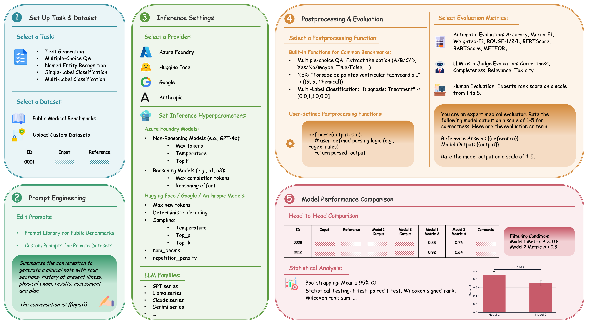

# BioEval

A web platform for benchmarking LLMs on biomedical NLP tasks.  
Supports inference via **Azure OpenAI** and **HuggingFace** (local GPU), with 12 built-in public benchmarks and the ability to **upload your own datasets**. Covers tasks including text generation, multiple-choice QA, named entity recognition, single-label classification, and multi-label classification.



---

## Prerequisites

| Requirement | Notes |
|---|---|
| [Docker Desktop](https://www.docker.com/products/docker-desktop/) (macOS) or [Docker Engine](https://docs.docker.com/engine/install/) + [Compose plugin](https://docs.docker.com/compose/install/) (Linux) | Required for the supported platforms below |
| NVIDIA GPU + [NVIDIA Container Toolkit](https://docs.nvidia.com/datacenter/cloud-native/container-toolkit/latest/install-guide.html) | Required only for local HuggingFace inference (**Linux only**). Azure OpenAI works without a GPU. |

---

## Quick Start

```bash
git clone https://github.com/Yale-BIDS-Chen-Lab/BioEval.git
cd BioEval/docker-files
cp .env.example .env
docker compose up --build
```

Open **http://localhost:3000**, create an account, and add an integration under **Settings**.

---

## Platform Notes

### macOS

1. Install [Docker Desktop for Mac](https://docs.docker.com/desktop/install/mac-install/).
2. For the default all-Docker setup, use the **Azure OpenAI** integration for inference. If you want local HuggingFace inference on Apple GPU, use the **macOS With Local HuggingFace on Apple GPU (MPS)** path below instead.
3. Open **Terminal**:
   ```bash
   cd docker-files
   docker compose up --build
   ```
4. Open **http://localhost:3000** in your browser.

### macOS With Local HuggingFace on Apple GPU (MPS)

Use this path if you want BioEval to keep the shared stack in Docker but run `inference-service` natively on your Mac so HuggingFace models can use `mps`.

Important:
- Choose **either** the default all-Docker path **or** this MPS path. Do **not** run `docker compose up --build` first and then start the host-native worker, or you will end up with both the Docker `inference` service and the macOS `inference-service` consuming the same RabbitMQ queues.
- If you already started the full Docker stack, stop it before switching to this path:
  ```bash
  cd docker-files
  docker compose down
  ```

1. Copy the Docker env file:
   ```bash
   cd docker-files
   cp .env.example .env
   ```
2. Start the shared services without the Docker `inference` container:
   ```bash
   cd docker-files
   ./start-macos-host-stack.sh
   ```
3. In a second terminal, start `inference-service` on macOS:
   ```bash
   cd inference-service
   ./scripts/run-macos-host.sh
   ```
4. Open **http://localhost:3000** in your browser.

### Linux

1. Install [Docker Engine](https://docs.docker.com/engine/install/) and the [Compose plugin](https://docs.docker.com/compose/install/linux/).
2. For GPU support, install the [NVIDIA Container Toolkit](https://docs.nvidia.com/datacenter/cloud-native/container-toolkit/latest/install-guide.html).
3. Run:
   ```bash
   cd docker-files
   docker compose up --build
   ```
   For HuggingFace inference with GPU:
   ```bash
   cd docker-files
   docker compose -f docker-compose.yml -f docker-compose-gpu.yml up --build
   ```
4. Open **http://localhost:3000** in your browser.

---

## Remote Server Access

If BioEval is running on a remote Linux server, forward the ports over SSH:

```bash
ssh -L 3000:localhost:3000 -L 3001:localhost:3001 user@your-server-ip
```

Then open **http://localhost:3000** in your local browser.

---

## Stopping & Resetting

```bash
# Stop all services
docker compose down

# Stop and delete all data (database, model outputs, datasets)
docker compose down -v
```

## Support

If you run into any issues, please open a GitHub issue and include your environment and logs when possible.
If you need help extending BioEval with new models, metrics, or benchmark workflows, please email xuguang.ai@outlook.com.

---

## License

This project is licensed under **CC BY-NC-ND 4.0**.
