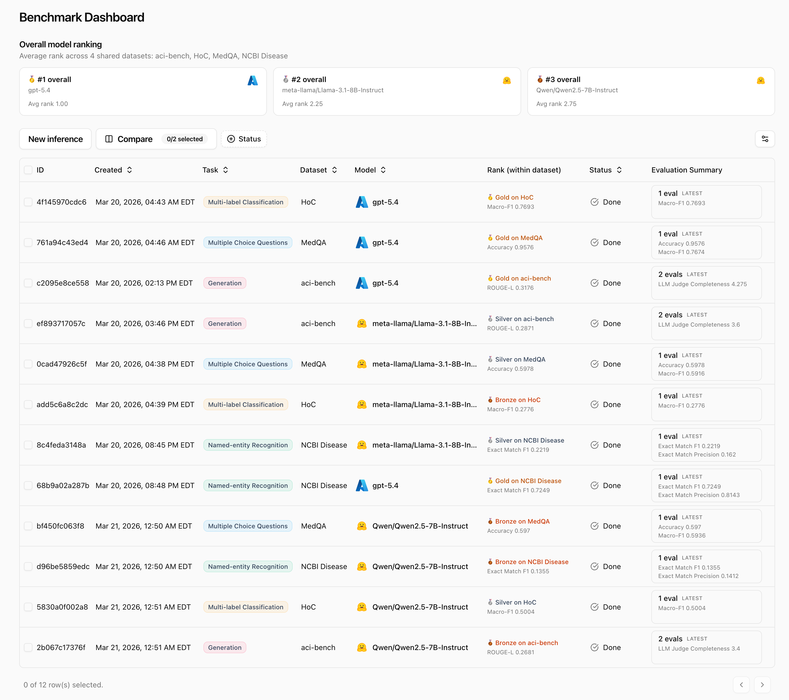
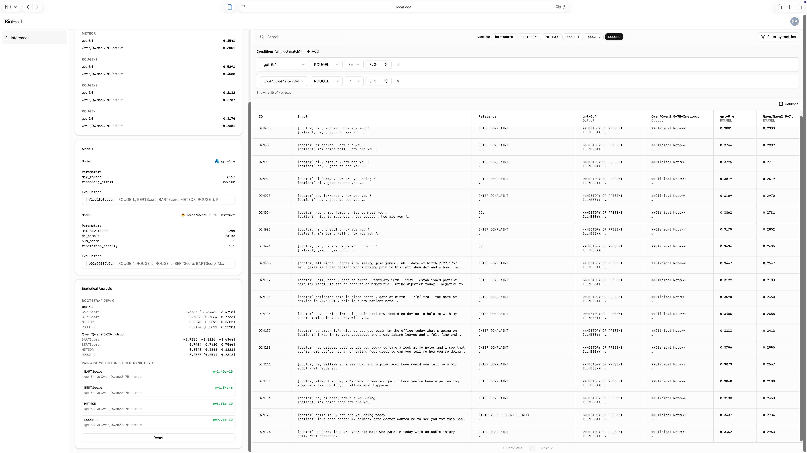

<div align="center">

<h1>BioEval</h1>

<p>Benchmark LLMs on medical NLP — from setup to statistical comparison, in one platform.</p>

<a href="https://github.com/Yale-BIDS-Chen-Lab/BioEval/blob/main/LICENSE.md"></a>

</div>

<br />

Evaluating LLMs on medical tasks usually means writing one-off scripts, wrangling provider APIs, and losing track of results across spreadsheets. BioEval is a self-hosted web platform that handles prompt engineering, inference, postprocessing & evaluation, head-to-head comparison, and statistical analysis in one place.

### 📊 Built-in Benchmarks
12 curated medical datasets covering QA, NER, relation extraction, classification, and summarization — including PubMedQA, MedQA, BC5CDR, and ChemProt.

### 🔀 One Workspace for the Entire Workflow
Configure prompts, run inference across Azure OpenAI, Google Gemini, Anthropic, and local GPU models, auto-evaluate with 10+ metrics, and compare results side by side with statistical significance tests — all without leaving the browser.

### 📁 Bring Your Own Benchmark
Upload custom datasets and evaluate them with the same pipeline and metrics.

<div align="center">
  <h4>Benchmark Dashboard</h4>
  
  <br /><br />
  <h4>Head-to-Head Comparison & Statistical Analysis</h4>
  
</div>

---

## Prerequisites

| Requirement | Notes |
|---|---|
| [Docker Desktop](https://www.docker.com/products/docker-desktop/) (macOS) or [Docker Engine](https://docs.docker.com/engine/install/) + [Compose plugin](https://docs.docker.com/compose/install/) (Linux) | Required for the supported platforms below |
| NVIDIA GPU + [NVIDIA Container Toolkit](https://docs.nvidia.com/datacenter/cloud-native/container-toolkit/latest/install-guide.html) | Required only for local NVIDIA GPU inference (**Linux only**). Cloud providers (Azure OpenAI, Google Gemini, Anthropic) work without a GPU. |

---

## Quick Start

```bash
git clone https://github.com/Yale-BIDS-Chen-Lab/BioEval.git
cd BioEval/docker-files
cp .env.example .env
docker compose up --build
```

Open **http://localhost:3000**, create an account, and add an integration under **Settings**.

---

## Setup by Platform

- [macOS (Cloud API Only)](#macos-cloud-api-only)
- [macOS with Local Inference on Apple GPU (MPS)](#macos-with-local-inference-on-apple-gpu-mps)
- [Linux (Cloud API Only)](#linux-cloud-api-only)
- [Linux with Local Inference on NVIDIA GPU](#linux-with-local-inference-on-nvidia-gpu)

### macOS (Cloud API Only)

1. Install and **open** [Docker Desktop for Mac](https://docs.docker.com/desktop/install/mac-install/) (the Docker daemon must be running before proceeding).
2. This setup uses cloud providers (Azure OpenAI, Google Gemini, Anthropic) for inference — no GPU required. If you want local inference on Apple GPU instead, use the **macOS with Local Inference on Apple GPU (MPS)** path below.
3. Open **Terminal**:
   ```bash
   cd docker-files
   cp .env.example .env
   docker compose up --build
   ```
4. Open **http://localhost:3000** in your browser.

### macOS with Local Inference on Apple GPU (MPS)

Use this path if you want BioEval to keep the shared stack in Docker but run `inference-service` natively on your Mac so local models can use the Apple GPU via `mps`.

Important:
- Choose **either** the default all-Docker path **or** this MPS path. Do **not** run `docker compose up --build` first and then start the host-native worker, or you will end up with both the Docker `inference` service and the macOS `inference-service` consuming the same RabbitMQ queues.
- If you already started the full Docker stack, stop it before switching to this path:
  ```bash
  cd docker-files
  docker compose down
  ```

1. Copy the Docker env file:
   ```bash
   cd docker-files
   cp .env.example .env
   ```
2. Start the shared services without the Docker `inference` container:
   ```bash
   cd docker-files
   ./start-macos-host-stack.sh
   ```
   This script uses `docker-compose.host-native.yml` so the Docker `backend`
   talks to the macOS host `inference-service` at `http://host.docker.internal:8000`
   instead of the Docker `inference` service.
3. In a second terminal, start `inference-service` on macOS:
   ```bash
   cd inference-service
   ./scripts/run-macos-host.sh
   ```
4. Open **http://localhost:3000** in your browser.

### Linux (Cloud API Only)

1. Install [Docker Engine](https://docs.docker.com/engine/install/) and the [Compose plugin](https://docs.docker.com/compose/install/linux/).
2. Run:
   ```bash
   cd docker-files
   cp .env.example .env
   docker compose up --build
   ```
3. Open **http://localhost:3000** in your browser.

### Linux with Local Inference on NVIDIA GPU

1. Install [Docker Engine](https://docs.docker.com/engine/install/) and the [Compose plugin](https://docs.docker.com/compose/install/linux/).
2. Install the [NVIDIA Container Toolkit](https://docs.nvidia.com/datacenter/cloud-native/container-toolkit/latest/install-guide.html).
3. Run:
   ```bash
   cd docker-files
   cp .env.example .env
   docker compose -f docker-compose.yml -f docker-compose-gpu.yml up --build
   ```
4. Open **http://localhost:3000** in your browser.

---

## Remote Server Access

If BioEval is running on a remote Linux server, forward the ports over SSH:

```bash
ssh -L 3000:localhost:3000 -L 3001:localhost:3001 user@your-server-ip
```

Then open **http://localhost:3000** in your local browser.

---

## Stopping & Resetting

```bash
# Stop all services
docker compose down

# Stop and delete all data (database, model outputs, datasets)
docker compose down -v
```

## Support

We welcome bug reports, feature requests, and questions — please [open a GitHub issue](https://github.com/Yale-BIDS-Chen-Lab/BioEval/issues). Including your OS, Docker version, and relevant logs helps us respond faster.

For help extending BioEval with new models, metrics, or benchmark workflows, feel free to email xuguang.ai@outlook.com.

---

## Contributing

See [CONTRIBUTING.md](CONTRIBUTING.md).

---

## License

This project is licensed under **PolyForm Noncommercial 1.0.0**.
See [LICENSE.md](LICENSE.md) or <https://polyformproject.org/licenses/noncommercial/1.0.0/>.
